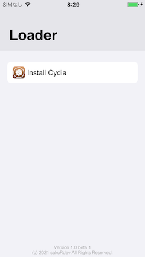
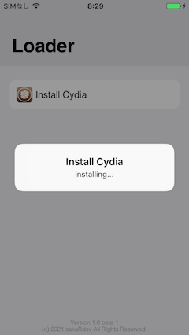

# p0insettia - build
A tool for [(semi-){un-(tethered jailbreak)}] of iOS 10.3.4 ~~32-bit devices~~ iPhone 5 with checkm8 BootROM exploit.  

## Note
All at your own risk!  

## Supported environments
- macOS 10.13 (or later?) (intel/x86_64)

## setup
```
./dl_files
./ramdisk_gen.sh
```

## Usage 
### Install loader / cydia  
The first step is to add the loader app to the rootfs of the device.  
Please set the device to DFU Mode, connect it, and run the following script.  
```
./ramdisk_boot.sh
```

The device will reboot and enter recovery mode.  
Please set the device to DFU Mode, connect it, and run the following script.  
```
./tethered_boot.sh
```

The device will show the loader app.  


Please open it and tap "Install Cydia".  
 

The device will reboot and enter recovery mode.  


### reboot and setup Cydia
Perform the initial startup. Please set the device to DFU Mode, connect it, and run the following script.  
```
./tethered_boot.sh
```

- Warning!  
The current version uses an old bootstrap, so please update all packages immediately after opening Cydia.  
Please turn off your device after the Cydia update is finished.  

### fix recovery mode
Now, when you try to reboot your device, it will boot in recovery mode. Connect the device in recovery mode to USB and run the following script.  
```
./fix_recovery.sh
```

The device will reboot and boot in non-jailbreak mode. If you want to boot in a jailbreak environment again, set the device to DFU mode and run the following script.  
```
./tethered_boot.sh
```

## LICENSE
hfsplus & xpwntool: GPL-3.0 [original](https://github.com/planetbeing/xpwn)  
irecovery: LGPL-v2.1 [original](https://github.com/libimobiledevice/libirecovery)  
